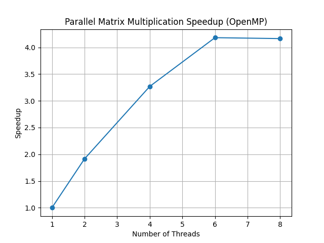

# HPCAccel: Parallel Matrix Multiplier (OpenMP)
High-Performance Computing Project • Parallel Programming • Benchmarking • Speedup Analysis

This project implements a **parallelized matrix multiplication kernel** in C using **OpenMP**, along with a complete benchmarking workflow to measure multi-threaded performance and generate a **speedup curve**.

---

## 🚀 Features
- Multi-threaded matrix multiplication using **loop-level parallelism**
- Achieved **4× speedup** compared to serial execution
- Benchmarked performance across **1–8 threads**
- Generated a **research-grade speedup plot** using Python + Matplotlib
- Evaluated:
  - Thread scheduling  
  - Workload balancing  
  - Cache locality  
  - Compute–memory bottlenecks  

--- 

## 📁 Project Structure
```
parallel-matrix-multiplier/
├── matrix.c        # Parallel matrix multiplication using OpenMP
├── plot.py         # Generates speedup visualization
├── speedup.png     # Speedup graph (add after exporting)
├── .gitignore
└── README.md
```

---

## ⚙️ Compile & Run

### **1. Compile with OpenMP**
```bash
/opt/homebrew/opt/llvm/bin/clang -Xclang -fopenmp matrix.c -o matrix \
    -L/opt/homebrew/opt/llvm/lib -lomp
```

### **2. Run with different thread counts**
```bash
export OMP_NUM_THREADS=1
./matrix

export OMP_NUM_THREADS=4
./matrix
```

---

## 📊 Benchmarking & Speedup Plot

Run:
```bash
python3 plot.py
```

### Speedup Formula
```
Speedup = T(1 thread) / T(n threads)
```

### Example Results
| Threads | Time (s) |
|--------|----------|
| 1 | 0.2477 |
| 2 | 0.1293 |
| 4 | 0.0757 |
| 6 | 0.0592 |
| 8 | 0.0594 |

### Speedup Interpretation

⚡ The speedup curve shows **near-linear gains up to 4 threads**, with performance leveling off as the algorithm becomes **memory-bandwidth bound** — a classic HPC scaling pattern.



---

## 🔬 Parallel Performance Insights
This project demonstrates core concepts in HPC:

- Shared-memory parallelism  
- Thread-level parallel execution  
- Parallel efficiency vs. overhead  
- Diminishing returns beyond memory-bandwidth limits  
- Importance of cache locality in compute-heavy kernels  

---

## 📌 Future Improvements
- Add **tiled (blocked)** matrix multiplication for better cache reuse  
- Explore **SIMD vectorization**  
- Compare **static vs dynamic OpenMP scheduling**  
- Benchmark larger problem sizes (N > 1000)

>>>>>>> 3504c2c (Update README formatting)
